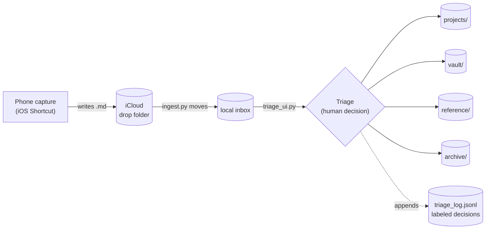

# ERGO · Note Intake

A capture-to-classification pipeline that turns a one-tap phone note into a structured, triaged markdown file — built as small, single-responsibility modules that hand off through plain file contracts.

This is the **note-intake module of ERGO**, a personal home-server orchestrator. It runs standalone, and every piece is usable on its own.

---

## The problem

Ideas arrive at the worst times — walking, driving, mid-conversation. Capture has to be frictionless or the thought is lost; classification has to be deliberate or the inbox becomes a graveyard. Most tools force a trade between the two.

This separates them. **Capture is instant and dumb. Classification is a focused, low-friction pass you run when you sit down.** Nothing is lost at capture, and nothing piles up unsorted.

## How it works



1. **Capture** — an iOS Shortcut writes a timestamped markdown note (YAML frontmatter + body) into an iCloud folder. Works offline, anywhere; no server required.
2. **Ingest** — `ingest.py` moves new notes out of iCloud into a local inbox, draining the source.
3. **Triage** — `triage_ui.py` serves a local page that walks the inbox one note at a time and routes each one, updating its frontmatter and moving the file.
4. **Board** — routed notes land in folders that represent their state.

## Design principles

- **Single responsibility.** Each module does exactly one thing and is independently runnable.
- **File contracts, not shared state.** Modules communicate only through an agreed file shape — a frontmatter schema plus a folder convention. Any producer or consumer that honors the contract plugs in: the iOS Shortcut today, a CLI, a voice pipeline later. The interface *is* the file, so backends are swappable without touching the rest.
- **Orchestrator pattern.** Modules never call each other; a launcher (or ERGO itself) sequences them. No module knows another exists.
- **Human-in-the-loop, instrumented.** Triage does not auto-classify. It makes a human decision *fast* and logs every one to `triage_log.jsonl` — a growing labeled dataset of real judgment. That dataset is the right foundation for automating triage later: record judgment before you try to automate it, and build the classifier from instances rather than guesses.

## Modules

| Module | One job | Interface |
|---|---|---|
| `note_capture.py` | Text in → frontmatter'd `.md` in an inbox | HTTP `POST /note` |
| `ingest.py` | Move notes from the capture folder into the local inbox | folder → folder |
| `triage.py` | Route a note (CLI): update frontmatter, move the file, log it | the note contract |
| `triage_ui.py` | Local web front-end for triage — dropdowns + free text | reuses `triage.py` |

## The note contract

Every note, from any source, is a markdown file shaped like this:

```
---
id: 2026-06-21_231759
created: 2026-06-21T23:17:59-04:00
source: ios-shortcut
project: null
tags: []
status: inbox
---

the note body
```

`status` moves `inbox → triaged | linked | archived` as it flows through. `project` is assigned at triage. Because this shape is fixed, a `.txt` and a `.md` are interchangeable, and any tool that reads frontmatter can consume the output.

## Setup

Requires Python 3.10+. `ingest.py` and `triage.py` are standard-library only; the two servers need FastAPI.

```bash
python3 -m venv .venv && source .venv/bin/activate
pip install -r requirements.txt
```

Create your launcher from the template and point it at your capture folder:

```bash
cp triage.command.example triage.command
chmod +x triage.command
# edit INGEST_SRC in triage.command to your capture folder
```

Run it:

```bash
./triage.command   # ingests new notes, then opens the triage page at http://localhost:8788
```

The launcher is self-locating: the data root is the folder it lives in, so `inbox/`, `projects/`, `vault/`, etc. are created beside the scripts.

## Repo layout

```
note_capture.py        capture endpoint
ingest.py              iCloud → local inbox
triage.py              routing core (CLI)
triage_ui.py           triage web UI
triage.command.example launcher template (copy to triage.command, gitignored)
requirements.txt
```

Personal data — your notes, decision log, active project list, and the venv — is gitignored and never leaves your machine.

## Status

Part of ERGO. Running in daily use.
